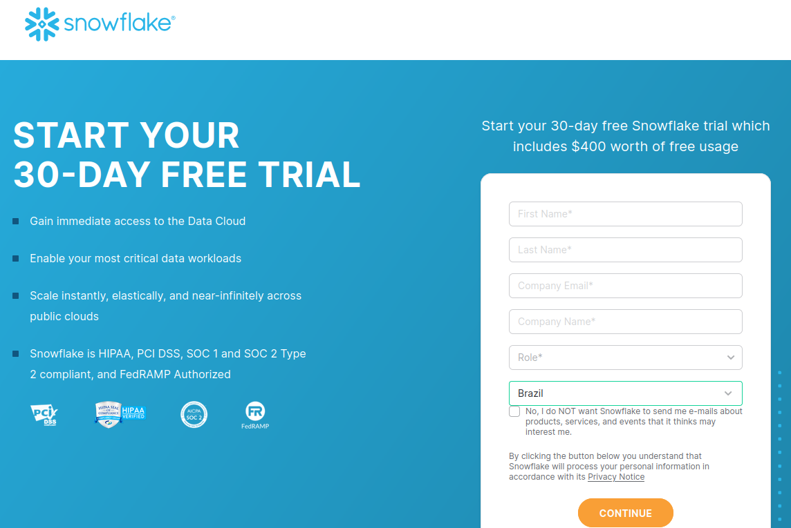
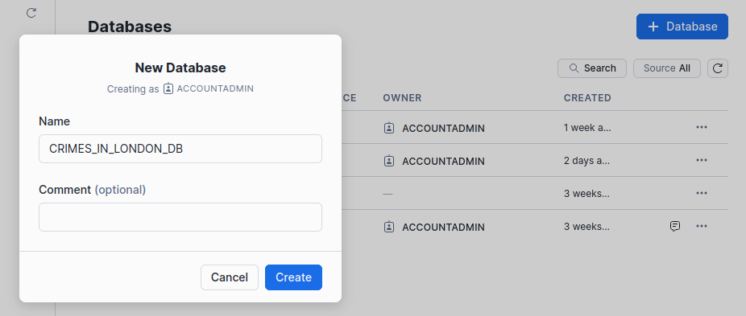
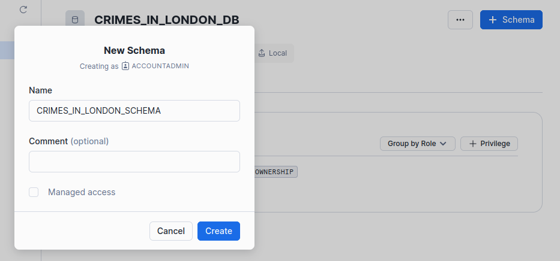
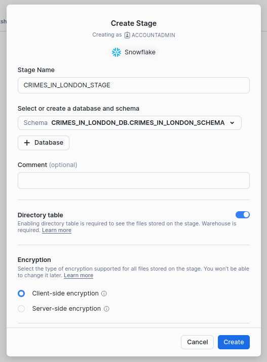
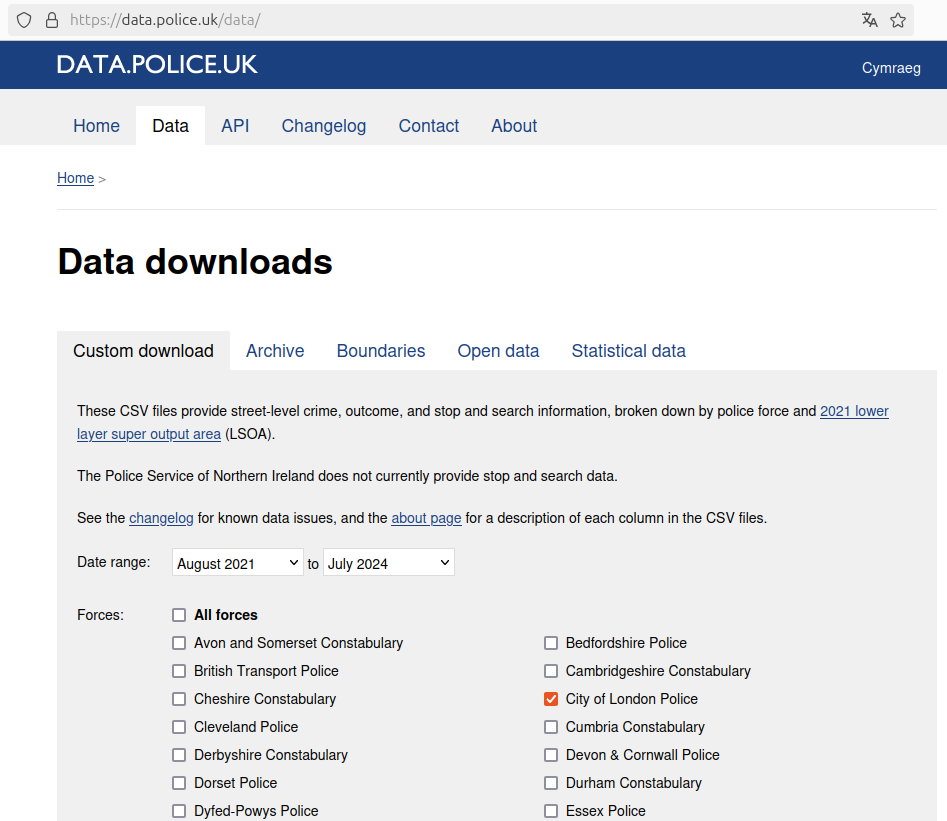
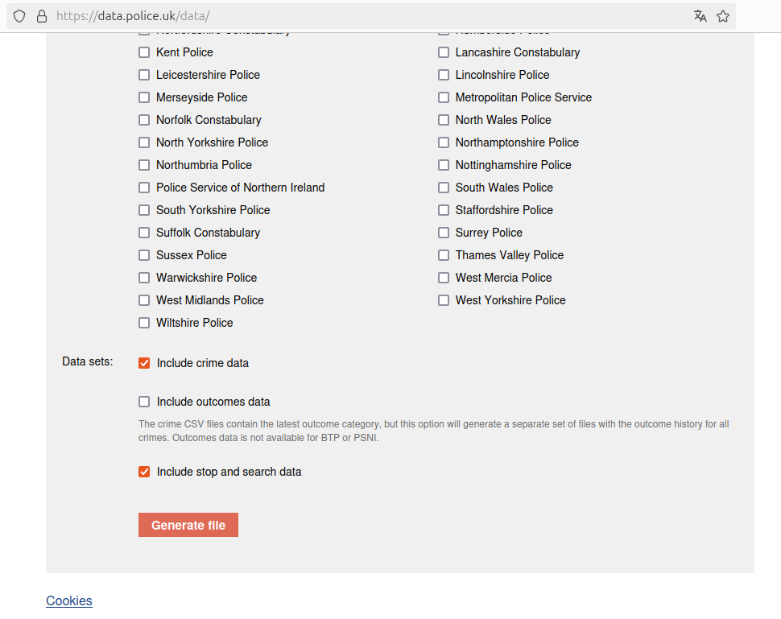

# Crimes em Londres

Este projeto visa auxiliar quem pretende visitar Londres ou quem mora em Londres. Com este aplicativo, você pode caminhar pelas áreas menos arriscadas para garantir sua segurança, evitando locais com maiores riscos de segurança.

# Preparando o Ambiente

## Crie uma conta gratuita no Snowflake



## Crie um Database




## Crie um Schema



## Crie uma Stage


> Em **Stage**, selecione **Snowflake Managed**



## Faça o clone do projeto

````
git clone https://github.com/rogerioelquinto/crimes_in_london_snowflake_streamlit.git
cd crimes_in_london_snowflake_streamlit
pip install -r requirements.txt
````

## Baixe a base de crimes

Vá no link: [https://data.police.uk/data/](https://data.police.uk/data/)





Salve o arquivo .zip dentro da raiz do projeto: **crimes_in_london_snowflake_streamlit**

Descompacte e renomeie o arquivo:

````
unzip 7fee6b59cb6868019892fbd7165bed34a700e99e
mv 7fee6b59cb6868019892fbd7165bed34a700e99e incoming
````
> Lembrando que o seu arquivo terá um nome diferente de **7fee6b59cb6868019892fbd7165bed34a700e99e**


