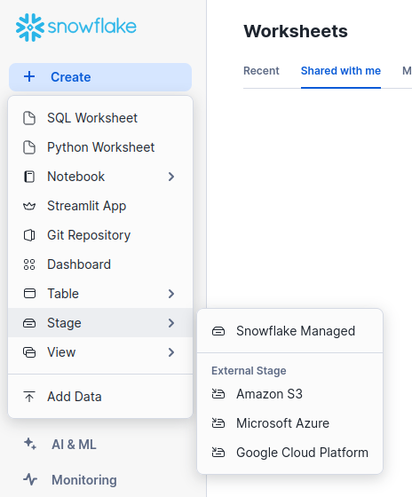
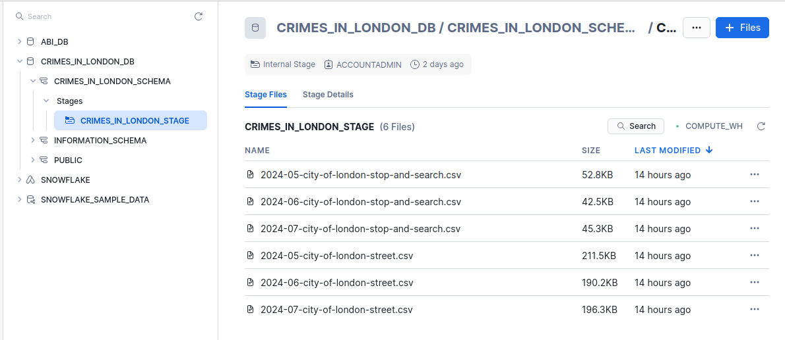
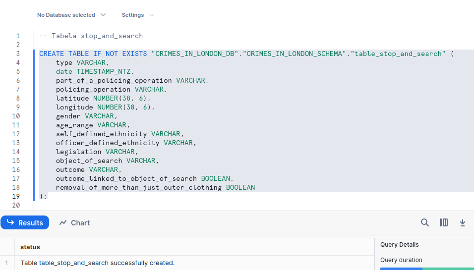
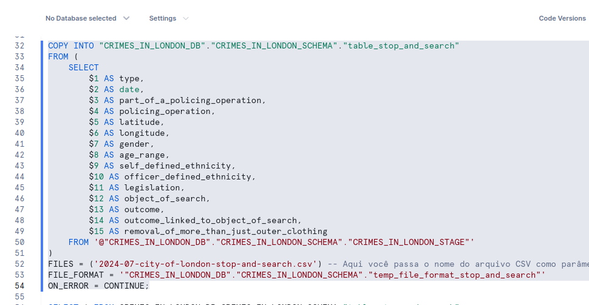
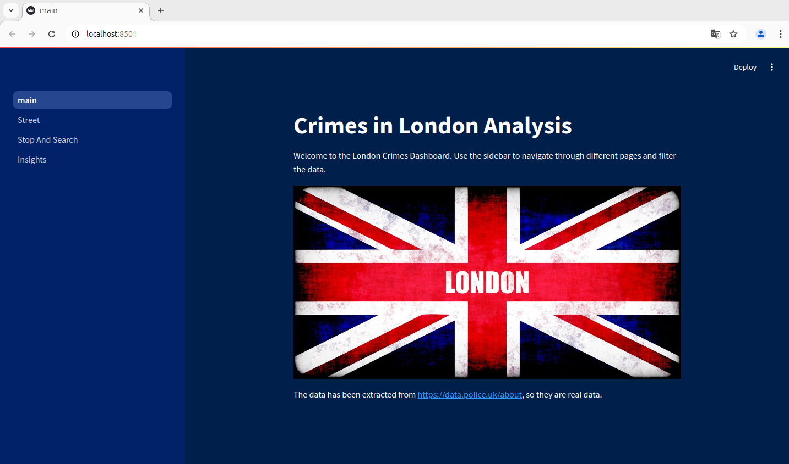
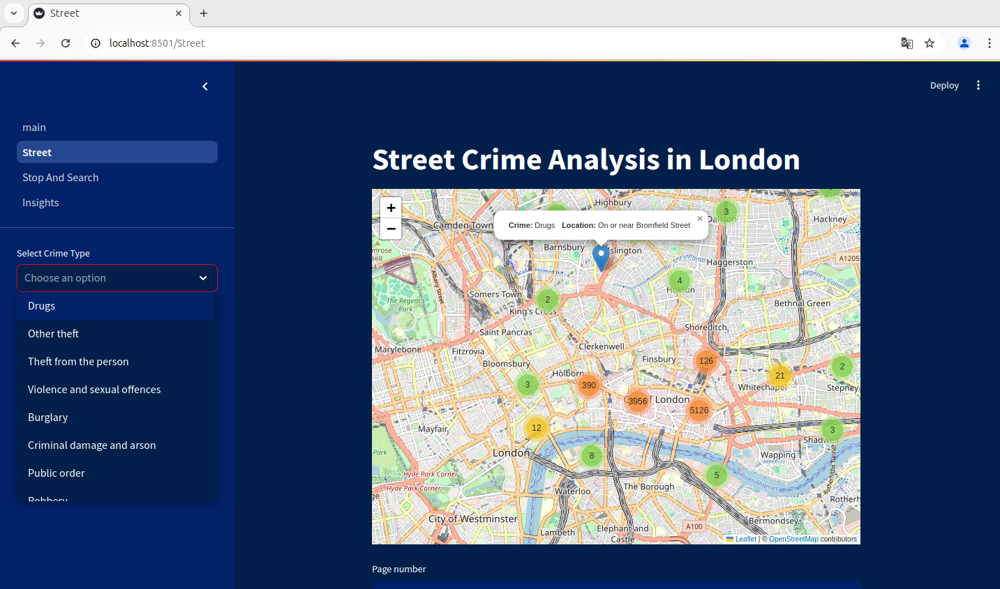
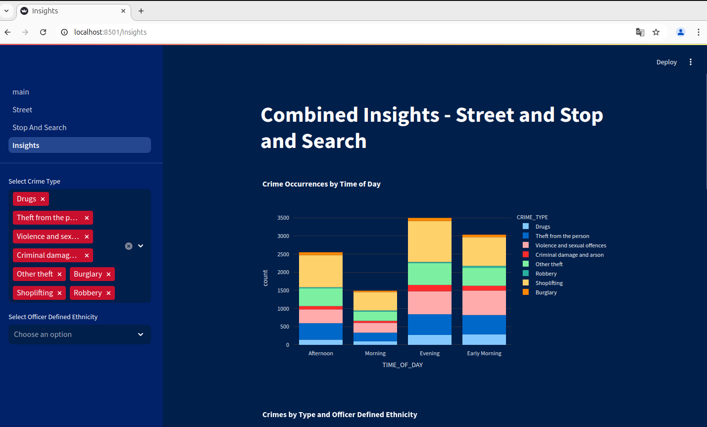

# Crimes in London

This project aims to assist those who plan to visit London or those who live in London. With this app, you can walk in the least risky areas to ensure your safety, avoiding places with higher security risks.

# Setting up the Environment

## Create a Free Snowflake Account


## Create a Database


## Create a Schema


## Create a Stage


> In **Stage**, select **Snowflake Managed**


## Clone the Project

````
git clone https://github.com/rogerioelquinto/crimes_in_london_snowflake_streamlit.git
cd crimes_in_london_snowflake_streamlit
pip install -r requirements.txt
````

## Download the Crime Dataset

Go to the link: [https://data.police.uk/data/](https://data.police.uk/data/)


Save the .zip file in the root folder of the project: **crimes_in_london_snowflake_streamlit**

Unzip and rename the file:

````
unzip 7fee6b59cb6868019892fbd7165bed34a700e99e
mv 7fee6b59cb6868019892fbd7165bed34a700e99e incoming
````
> Note that your file will have a different name than **7fee6b59cb6868019892fbd7165bed34a700e99e**

The directory will contain the following content:

````
ls incoming/
2021-08  2021-11  2022-02  2022-05  2022-08  2022-11  2023-02  2023-05  2023-08  2023-11  2024-02  2024-05
2021-09  2021-12  2022-03  2022-06  2022-09  2022-12  2023-03  2023-06  2023-09  2023-12  2024-03  2024-06
2021-10  2022-01  2022-04  2022-07  2022-10  2023-01  2023-04  2023-07  2023-10  2024-01  2024-04  2024-07

ls incoming/2024-07
2024-07-city-of-london-stop-and-search.csv  2024-07-city-of-london-street.csv
````

## Upload Files to the Stage

````
python3 upload_to_snowflake.py --file incoming/2024-07/2024-07-city-of-london-street.csv --stage CRIMES_IN_LONDON_STAGE 
python3 upload_to_snowflake.py --file incoming/2024-06/2024-06-city-of-london-street.csv --stage CRIMES_IN_LONDON_STAGE 
python3 upload_to_snowflake.py --file incoming/2024-05/2024-05-city-of-london-street.csv --stage CRIMES_IN_LONDON_STAGE

python3 upload_to_snowflake.py --file incoming/2024-07/2024-07-city-of-london-stop-and-search.csv --stage CRIMES_IN_LONDON_STAGE 
python3 upload_to_snowflake.py --file incoming/2024-06/2024-06-city-of-london-stop-and-search.csv --stage CRIMES_IN_LONDON_STAGE 
python3 upload_to_snowflake.py --file incoming/2024-05/2024-05-city-of-london-stop-and-search.csv --stage CRIMES_IN_LONDON_STAGE 
````

## Verify the Uploaded Files in the Stage



## Configure the Credentials in the *.streamlit/secrets.toml* File

````
[snowflake]
account = "PVXXXNRR-RXXXX3375"
user = "your_username"
password = "***********"
role = "ACCOUNTADMIN"
warehouse = "COMPUTE_WH"
database = "CRIMES_IN_LONDON_DB"
schema = "CRIMES_IN_LONDON_SCHEMA"
````

> These credentials allow you to run your application and access the data from the tables created from the CSV files uploaded to the stage.

## Creating the *table_stop_and_search* and *table_street* Tables, Defining Format, and Loading Data

Use the [queries_load.sql](https://github.com/rogerioelquinto/crimes_in_london_snowflake_streamlit/blob/main/queries_load.sql) script to create the tables.


> Select **SQL Worksheet** to run the SQL commands from the **queries_load.sql** file


> To run the selected code block, press **CTRL+ENTER**




Change the **FILES** variable to match the name of the files you uploaded to the Stage, and run the last block (**COPY INTO**...) for the remaining files you want to load:
````
(...)
FILES = ('2024-07-city-of-london-stop-and-search.csv') -- Pass the CSV file name as a parameter here
(...)
FILES = ('2024-07-city-of-london-street.csv') -- Pass the CSV file name as a parameter here
````

## Running the Application 

````
streamlit run main.py
````




