# Crimes em Londres

Este projeto visa auxiliar quem pretende visitar Londres ou quem mora em Londres. Com este aplicativo, você pode caminhar pelas áreas menos arriscadas para garantir sua segurança, evitando locais com maiores riscos de segurança.

# Preparando o Ambiente

## Crie uma conta gratuita no Snowflake

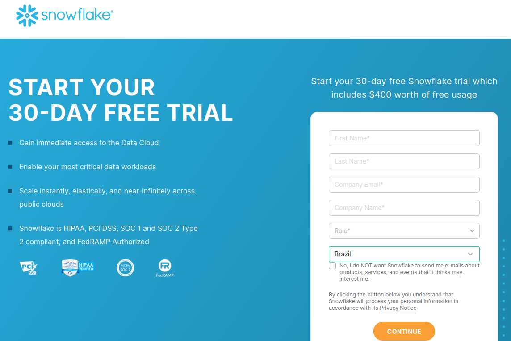

## Crie um Database

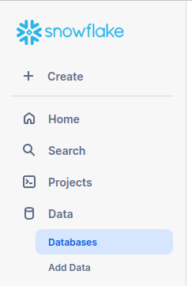
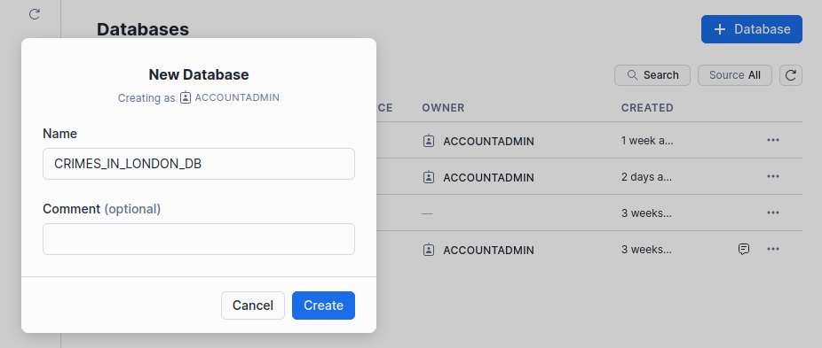

## Crie um Schema

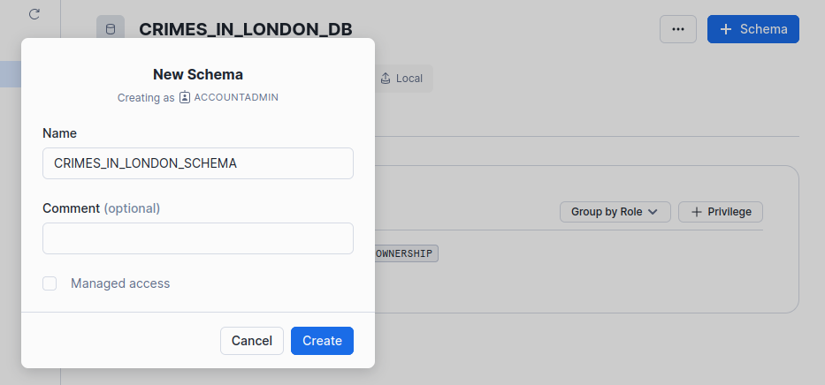

## Crie uma Stage

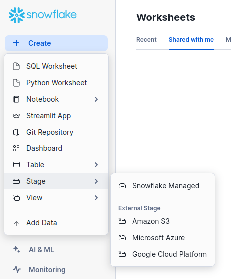
> Em **Stage**, selecione **Snowflake Managed**

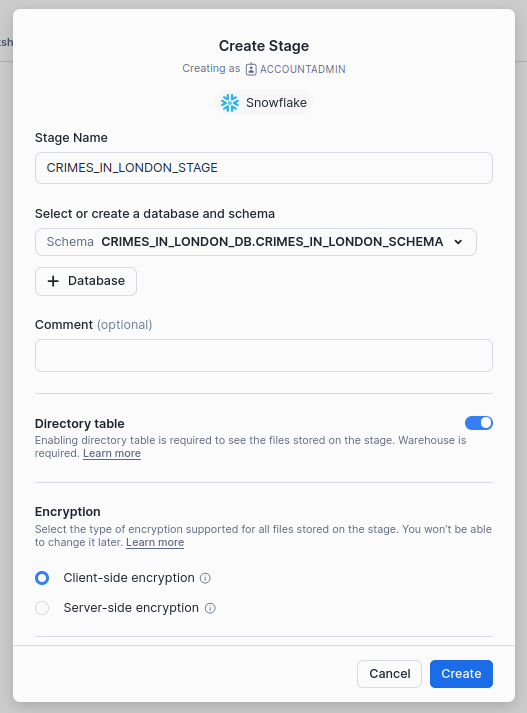

## Faça o clone do projeto

````
git clone https://github.com/rogerioelquinto/crimes_in_london_snowflake_streamlit.git
cd crimes_in_london_snowflake_streamlit
pip install -r requirements.txt
````

## Baixe a base de crimes

Vá no link: [https://data.police.uk/data/](https://data.police.uk/data/)

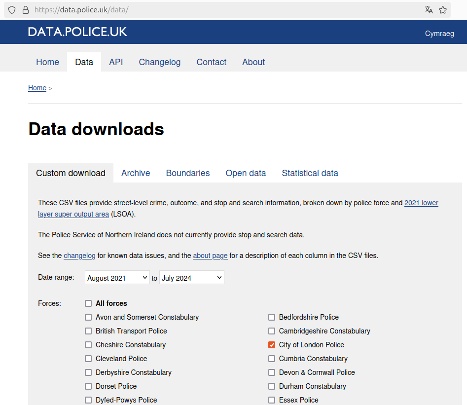
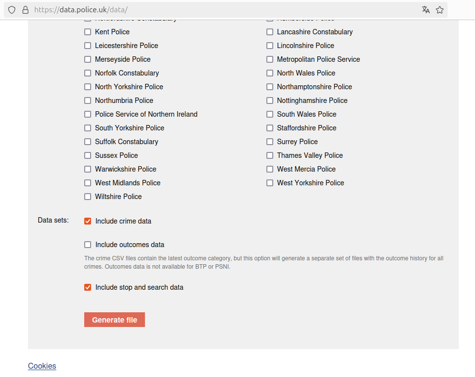
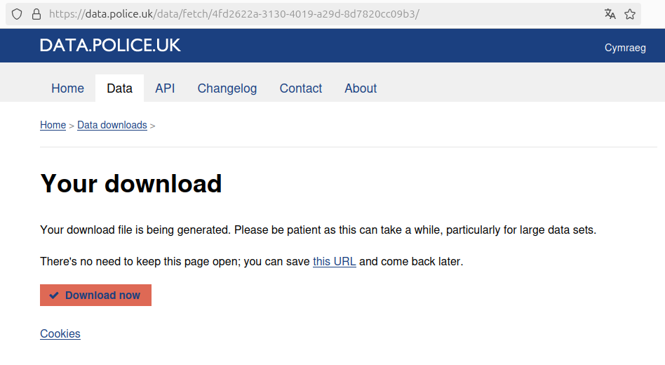

Salve o arquivo .zip dentro da raiz do projeto: **crimes_in_london_snowflake_streamlit**

Descompacte e renomeie o arquivo:

````
unzip 7fee6b59cb6868019892fbd7165bed34a700e99e
mv 7fee6b59cb6868019892fbd7165bed34a700e99e incoming
````
> Lembrando que o seu arquivo terá um nome diferente de **7fee6b59cb6868019892fbd7165bed34a700e99e**

O diretório (pasta) terá o seguinte conteúdo:

````
ls incoming/
2021-08  2021-11  2022-02  2022-05  2022-08  2022-11  2023-02  2023-05  2023-08  2023-11  2024-02  2024-05
2021-09  2021-12  2022-03  2022-06  2022-09  2022-12  2023-03  2023-06  2023-09  2023-12  2024-03  2024-06
2021-10  2022-01  2022-04  2022-07  2022-10  2023-01  2023-04  2023-07  2023-10  2024-01  2024-04  2024-07

ls incoming/2024-07
2024-07-city-of-london-stop-and-search.csv  2024-07-city-of-london-street.csv
````

## Faça o upload de quantos arquivos desejar para a Stage

````
python3 upload_to_snowflake.py --file incoming/7fee6b59cb6868019892fbd7165bed34a700e99e/2024-07/2024-07-city-of-london-street.csv --stage CRIMES_IN_LONDON_STAGE 
python3 upload_to_snowflake.py --file incoming/7fee6b59cb6868019892fbd7165bed34a700e99e/2024-06/2024-06-city-of-london-street.csv --stage CRIMES_IN_LONDON_STAGE 
python3 upload_to_snowflake.py --file incoming/7fee6b59cb6868019892fbd7165bed34a700e99e/2024-05/2024-05-city-of-london-street.csv --stage CRIMES_IN_LONDON_STAGE

python3 upload_to_snowflake.py --file incoming/7fee6b59cb6868019892fbd7165bed34a700e99e/2024-07/2024-07-city-of-london-stop-and-search.csv --stage CRIMES_IN_LONDON_STAGE 
python3 upload_to_snowflake.py --file incoming/7fee6b59cb6868019892fbd7165bed34a700e99e/2024-06/2024-06-city-of-london-stop-and-search.csv --stage CRIMES_IN_LONDON_STAGE 
python3 upload_to_snowflake.py --file incoming/7fee6b59cb6868019892fbd7165bed34a700e99e/2024-05/2024-05-city-of-london-stop-and-search.csv --stage CRIMES_IN_LONDON_STAGE 
````

## Verique os arquivos carregados na Stage


## Configure as credenciais no arquivo *.streamlit/secrets.toml*

````
[snowflake]
account = "PVXXXNRR-RXXXX3375"
user = "nome_do_seu_usuario"
password = "***********"
role = "ACCOUNTADMIN"
warehouse = "COMPUTE_WH"
database = "CRIMES_IN_LONDON_DB"
schema = "CRIMES_IN_LONDON_SCHEMA"
````

> Por meio destas credenciais você poderá rodar sua aplicação acessando os dados das tabelas que serão criadas com base nos arquivos .csv na stage.

## Criando  as tabelas *table_stop_and_search* e *table_street*, definindo o formato e carregando dados

Use o script [queries_load.sql](https://github.com/rogerioelquinto/crimes_in_london_snowflake_streamlit/blob/main/queries_load.sql) para criar as tabelas.

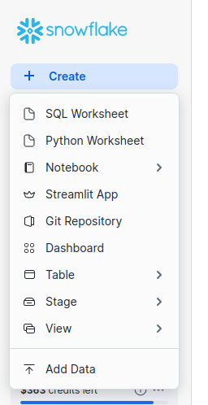
> Selecione **SQL Worksheet** para executar as instruções SQL do arquivo **queries_load.sql**

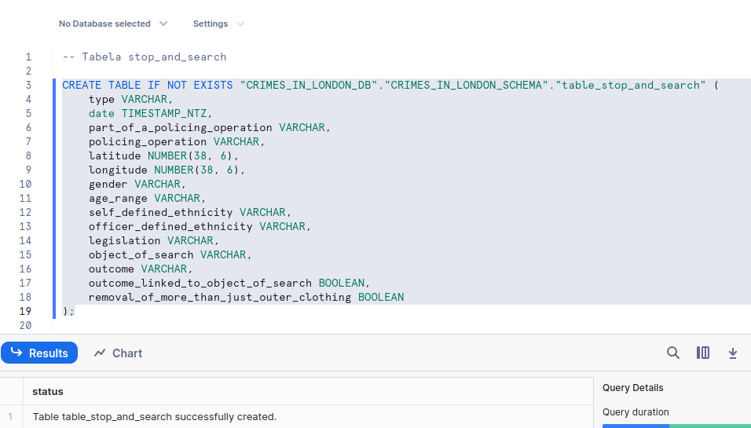
> Para executar o bloco de código selecionado, utilize **CTRL+ENTER**

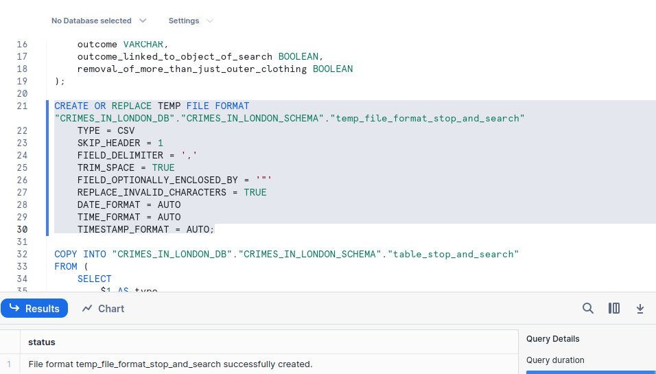
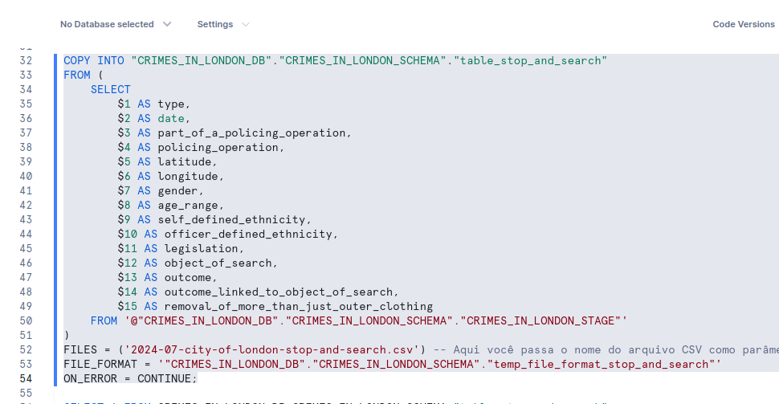

Altere a variável **FILES** para o nome dos arquivos que você carregou na Stage e execute o ultimo bloco (**COPY INTO...**) para os demais arquivos que deseja carregar:
````
(...)
FILES = ('2024-07-city-of-london-stop-and-search.csv') -- Aqui você passa o nome do arquivo CSV como parâmetro
(...)
FILES = ('2024-07-city-of-london-street.csv') -- Aqui você passa o nome do arquivo CSV como parâmetro
````

## Executando a aplicação 

````
streamlit run main.py
````

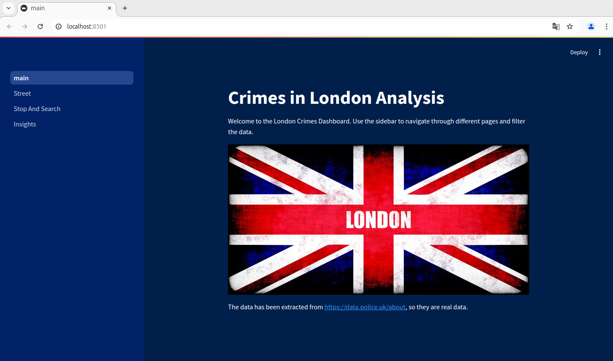
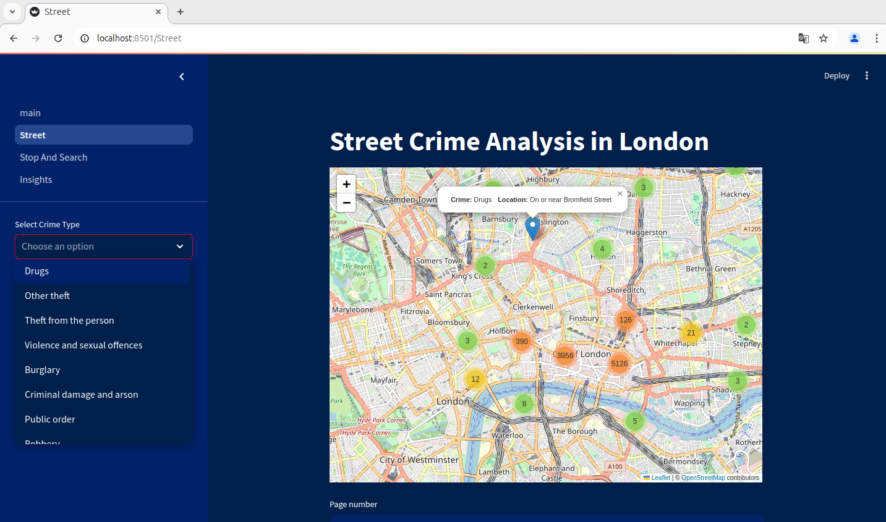
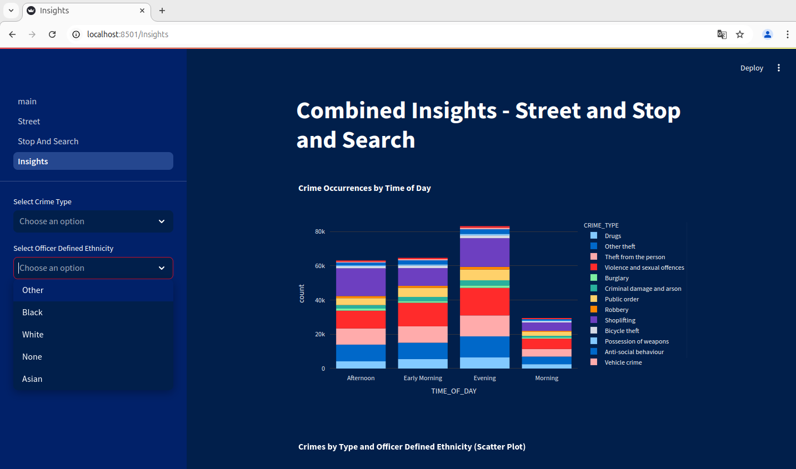
